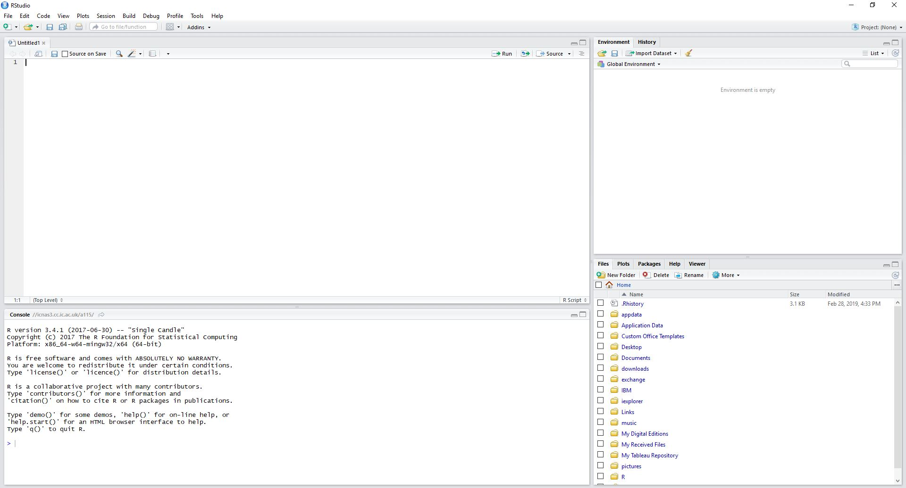

# Introduction

This workshop introduces the [tidyverse](https://www.tidyverse.org/) packages, which support data processing and visualisation in R.
All of these packages share the same concepts of data handling, which makes it easier to build workflows that move between different kinds of task:

- Reading tabular data (with `readr`)
- Tidying data (with `tidyr`)
- Transforming data (with `dplyr`)
- Data visualisation (with `ggplot2`)
- Applying statistical tests

This workshop assumes a basic familiarity with the R language, as covered in the introductory *R Programming* workshop.


## Getting started in RStudio



- Bottom left: console window (type commands here and see the output directly)
- Top left: editor window (for editing R notebooks and scripts)
- Top right: workspace / history window (examine the current workspace, import datasets, see commands entered previously)
- Bottom right: files / plots / packages / help window (change working directory, install packages, see graphics output, browse help)

## R notebooks

This document is an example of an *R notebook*, which combines text and code and makes it easy to embed R analysis within a report (ouput as HTML, PDF, Word document or presentation slides). This can help to make research more reproducible by allowing you to share an entire analysis workflow together with a narrative.

When you open the notebook's source code (*.Rmd* file) in RStudio, you can view and edit it in the editor window.

Text is formatted using the [R markdown](https://rmarkdown.rstudio.com/) notation, which is derived from [Markdown](https://github.com/adam-p/markdown-here/wiki/Markdown-Cheatsheet). This is a simple way to apply styling to text and indicate the structure of your document.

R code is included as *chunks*, which look like this:

```{r}
## R code lives here
print("Hello RStudio!")
```

When the cursor is inside a chunk, you can execute the code using *Ctrl-Shift-Enter*. The commands and output appear in the console window as if the chunk had been copy-pasted there. The output also appears in the notebook just after the chunk.

A notebook is a living document. You are encouraged to make use of this notebook to try out the example code, alter it, complete the exercises and add your own notes and code chunks. You can insert a new code chunk using the shortcut _Ctrl+Alt+I_.


## Working directory

Before you start work, please check your working directory:

```{r eval=FALSE}

getwd()

```

You can change the working directory using the files window in RStudio (bottom right).
Navigate to the directory containing the workshop data and click the cog icon for the "Set as Working Directory" option.


## About packages

Many useful R functions are developed by individuals and research groups and made available to the community as *packages*.

You can find a full list of R packages at the [CRAN](https://cran.r-project.org/) page.

The tidyverse packages are installed with:
```{r eval=FALSE}

install.packages("tidyverse")

```

and loaded into the workspace with:
```{r eval=FALSE}

library(tidyverse)

```

Note that this command loads all of the core tidyverse packages, but you can also load them individually as necessary.


## The data

Today's session will focus on data taken from the [GapMinder](https://www.gapminder.org/data/) project.


# Loading data (**readr**)

## Excel spreadsheets

To begin, we will use the [readxl](https://readxl.tidyverse.org/) package to load data from the relevant sheets in the Excel workbook.
This package is not part of the core tidyverse, so we need to load it directly:

```{r}
library(readxl)
```

The command `read_excel()` reads both xls and xlsx files and detects the format from the extension.
Today we will only use the sheet called `list-of-countries-etc` from this workbook.

```{r}
read_excel("data_geographies_v1.xlsx", sheet = "list-of-countries-etc")
```

RStudio shows you the output as a table.
Let's capture the loaded data using the variable `countries`:

```{r}
countries <- read_excel("data_geographies_v1.xlsx", sheet = "list-of-countries-etc")
```

We can get a quick overview of the data using the `str()` function:

```{r}
str(countries)
```


## Tibbles

Notice that as well the class `data.frame`, the object `countries` also belongs to the classes `tbl_df` and `tbl`.
This shows that the data has been loaded in the form of a [tibble](https://tibble.tidyverse.org/).

Tibbles are part of the tidyverse architecture. They are like data frames, but they do **less** (e.g., they don't attempt to coerce variables into different types) and complain **more** (e.g., when a variable does not exist). The idea is to force the programmer to deal with issues earlier, and so make it harder to write confusing or broken R code.

## CSV files

Let's look at another, related data set, this time loaded from a CSV file using `read_csv()` from the [readr](https://readr.tidyverse.org/) package:

```{r}

co2 <- read_csv("yearly_co2_emissions_1000_tonnes.csv")
co2

```

This is a straightforward numerical tibble which contains a lot of missing values. 
The table shows annual CO2 emissions from burning fossil fuels for each country.

NB `read_csv()` is a different function to `read.csv()` from base R (which outputs a base `data.frame` rather than a `tbl_df`).

Tabular data in other formats (e.g. with tabs as delimiters, or using fixed-width fields) can also be read using other functions from `readr`.


# Tidying data (**tidyr**)

The tidyverse packages put a lot of emphasis on working with **tidy** data. What do we mean by that?

Tidy data has the three following attributes:

1. Every column is a variable
2. Every row is an observation (also known as a "case")
3. Every cell holds a single value

When data is tidy, we can visualise and analyse it more easily.

However, most of the data tables that you encounter "in the wild" will not be tidy by this definition, so the [tidyr](https://tidyr.tidyverse.org/) package provides functions to help reshape them into a tidy form.

Look at the `co2` tibble. What are the observations and what are the variables?

## gather()

We can use the `gather()` function to tidy the `co2` tibble:

```{r}
co2 <- gather(co2, -country, key=year, value=kt, na.rm=TRUE)
co2
```

`gather()` works to **lengthen** the data table by collecting observations from multiple columns.

We specify the columns to use (all columns except the country name) and provide the names of two new variables, one to hold the old variable names ("year") and one to hold
the observations collected ("tonnes_per_person"). 

Notice that the tidyverse functions usually allow you to omit quotes when referring to column names.

By setting `na.rm=TRUE`, we discard the cells that did not contain observations.

## Changing data type

One complication here is that the `year` variable is shown as having a character data type. This is because the years have been derived from column names (strings) in the previous version of the table. Let's fix this before going any further:

```{r}

co2$year <- parse_integer(co2$year)
co2

```


## CSV without headers

Now that `co2` is in a tidy form, let's look at another example. `1997_stats.csv` is a CSV file containing GDP and population for various countries for the year 1997.

Actually this file is not in a correct CSV format, because it is missing a header row. You can open it in Excel to verify this. However, we can still load it using `read_csv()` as follows:

```{r}
stats97 <- read_csv("1997_stats.csv", col_names=FALSE)
stats97
```

You can see that the two columns in this file have been given the names `X1` and `X2`.

This file looks a bit harder to tidy. What are the variables in this data set and what are the observations?

## separate()

First, we need to split the `X1` data into two columns: one for the three-letter country code (the variable named `geo` in our `countries` tibble) and one for the type of measurement (GDP or population).
We can do this with the function `separate()`:

```{r}
stats97 <- separate(stats97, col=X1, sep="-", into=c("geo","measurement"))
stats97
```

Take a look at the command above. The arguments to `separate()` give the tibble to be processed, the name of the column to be split, the string to use as the delimiter, and a vector of strings giving the names for the resulting columns.

## spread()

Now we need to separate the GDP and population values into two different columns. This is done using the `spread()` function:

```{r}
stats97 <- spread(stats97, key=measurement, value=X2) 
stats97
```

Notice that there are fewer rows than before; The `spread()` action **shortens** the length of the table. 

Now each column is a variable, each row is an observation, and each cell is a single vale, so we have successfully tidied `stats97`.

The [readr/tidyr cheat sheet](https://github.com/rstudio/cheatsheets/raw/master/data-import.pdf) gives a useful summary of the tidyverse functions for loading and tidying data.


# Visualising data (**ggplot2**)

Having loaded some numerical data, a sensible first step is to visualise the distributions of variables to check for any issues.

Although there are many useful plotting functions available in base R, in this session we will focus on making plots using the tidyverse package `ggplot2`. This is a very powerful set of functions that support a consistent approach to data visualisation. `ggplot2` makes it much easier to create high-quality graphics for presentations and publications.

## Histogram

Let's start with a histogram for the GDP data from the `stats97` tibble:

```{r}
stats97
```

Some of the GDP values are missing, so let's remove those rows as a first step, using `drop_na()` from `readr`:

```{r}

gdp97 <- drop_na(stats97, gdp)
gdp97

```


```{r}
a <- ggplot(gdp97, aes(x=gdp))
hist <- a + geom_histogram(bins=100)
hist
```

Notice that there are two steps to creating the plot. 

The first line constructs the data space by specifying the dataset (`gdp97`) and the variable(s) of interest 
(in this case, just `gdp`). The `aes()` function controls the *aesthetic mappings* used by `ggplot2`, i.e. the way in which the data will be mapped to visual elements. 

In the second step, we add in a histogram *geom* that paints in the histogram bars and constructs the y-axis. Geoms are the actual visual marks that 
encode the data. `ggplot2` provides geoms for all the commonly-used plot types, but also graphical primitives such as curves, lines and polygons, from which other visualisations can be built.

The `ggplot2` defaults for axes, labels etc. are usually informative enough for data exploration, but of course everything can be modified if necessary.
For example, to add at title, change the histogram colour and show population on a log scale:

```{r}
hist <- a + geom_histogram(bins=20, fill="blue", alpha=0.5) + labs(x="GDP", title="Countries in 1997") + scale_x_log10()
hist
```

## Saving plots to file

We can save the last plot made to a file using

```{r}
ggsave("my_histogram.pdf")
```
The file type is determined by the file extension and the size of the image can be changed using `width` and `height` options.


## Violin plot

The same data can be plotted using the `geom_violin()` geom. This time we will map `gdp` to the y coordinate:

```{r}

ggplot(gdp97, aes(y=gdp, x="")) + geom_violin(fill="blue", alpha=0.5, linetype=0) + scale_y_log10()

```


## Scatter plot

We can visualise covariation between variables using a scatter plot, for example GDP vs population. This uses `geom_point()`:

```{r}

ggplot(gdp97, aes(x=pop, y=gdp)) + 
  geom_point() + 
  scale_x_log10() + 
  scale_y_log10() 

```


The [ggplot2 cheat sheet](https://github.com/rstudio/cheatsheets/raw/master/data-visualization-2.1.pdf) gives much more information about plotting options.


# Manipulating data (**dplyr**)

The [dplyr]() package deals with many types of data manipulation that are needed as part of any analysis workflow. 


## mutate()

It might be more useful to compare countries' GDP on a per-capita basis. We need to make a new variable to show per-capita GDP. 
To do this, we will use the `mutate()` function, which adds new columns to the tibble:

```{r}

gdp97 <- mutate(gdp97, gdp_pp=gdp/pop)
gdp97

```

Note that like all dplyr functions (and despite its name), the `mutate()` function does not actually change the original tibble used as input, so we still need to capture the output using `<-`.


#### Exercise {-}

Visualise the distribution of the new variable `gdp_pp`.

```{r}


```


## Selecting and filtering data


### filter()

With tidy data, it is easy to filter cases according to whatever conditions we specify, e.g.:


```{r}

filter(gdp97, gdp_pp > 30000, pop < 1000000)

```


### select()

We can extract a subset of variables using select(), e.g.:

```{r}

select(gdp97, c(geo,gdp_pp))

```


### pull()

If you just want the values from a single column, use `pull()` to extract them as a vector:

```{r}

pull(gdp97, geo)

```


### arrange()

Use `arrange()` to sort a tibble by ascending column value:

```{r}

arrange(gdp97, pop)

```


...or by descending value using `desc()`:

```{r}

arrange(gdp97, desc(pop))

```


The [dplyr cheat sheet](https://github.com/rstudio/cheatsheets/blob/master/data-transformation.pdf) gives useful summaries of these and other functions for data manipulation.


#### Exercise {-}

Use manipulations of the `countries` tibble to complete the following tasks:


1. Find the Asian countries that are south of the equator.

```{r}


```

2. Find the first five African countries to join the UN.

```{r}


```

3. Make a vector of OECD country names, sorted from East to West.

```{r}


```


#### Exercise {-}

Starting with the `co2` tibble, plot the annual emissions of a country of your choice.
*Hint*: use the `geom_line()` geom.

```{r}


```


## Joining tables

To compare emissions between countries in a fair way, it would make sense to convert them to a per-capita basis. 
Let's start with the figures for 1997 to see how this can be done.

First we will make a new tibble containing only the 1997 emissions:

```{r}

co2_1997 <- filter(co2, year==1997)
co2_1997

```

However, the population data is not yet in the co2 tibble, so we will need to look it up from another tibble by matching the country name. 
This type of **relational data**, where information must be collected from multiple tables, requires careful handling to make sure that rows in different tables are correctly associated with each other. The country name acts as a **key** to unlock the correct data from the associated table.

The relevant population data is in the stats97 table: 

```{r}
stats97
```

However, this is indexed by the `geo` code, rather than the `country` name that we find in `co2_1997`. Fortunately, the `countries` tibble contains both:

```{r}
countries
```

Taking the `co2_1997` data, we apply a `left_join()` to connect its `country` variable to the `name` variable in `countries`:

```{r}

co2_1997 <- left_join(co2_1997, countries, by=c("country"="name"))
co2_1997

```

For every row in the original table, `left_join()` tries to match its `country` with a `name` in `countries`. 
The resulting table imports the additional columns from the `countries` tibble, so now we can associate each `geo` code with the correct CO2 emissions.

`left_join()` is just one of several `dplyr` functions for working with relational data.
You can read more about relational data in the [R for Data Science](https://r4ds.had.co.nz/relational-data.html) online textbook.


#### Exercise {-}

Use another `left_join()` to connect `co2_1997` to `stats97`.
*Hint*: `dplyr` will automatically match keys where the variable names are the same, so this join is a little easier than the last one.


```{r}


```


#### Exercise {-}

Calculate the per-capita emissions for 1997 as a new column and plot these on a histogram.

```{r}


```


# Pipes

Often, the operations we want to apply to data require several steps. 
Because R is organised around functions, we can sometimes get tied up with nested parentheses `()`, or confused by a lot of intermediate variables.

One solution for more understandable code is to make use of **pipes** (from the [magrittr](https://magrittr.tidyverse.org/) package) to chain functions together.

The pipe operator is `%>%`.

We can think of `x %>% f` as having the same meaning as `f(x)`.

A simple example:

```{r}

1:10 %>% mean

```


We can also pipe the output to a new function:

```{r}
1:10 %>% 
  mean %>%
  log
```


To capture the result of a chain of pipes, use variable assignment with the arrow operator as normal:

```{r}
x <- 1:10 %>% 
  mean %>%
  log

x
```


By default, the piped value is used as the **first argument** of the function to which it is directed. 

Any further **positional arguments** that are given to the function will be associated with the second argument onwards:

```{r}

1:10 %>%
  sample(5)  # sample(x, s) returns a random sample (without replacement) of size s from the vector x

```


However, for functions that take more than one argument, sometimes we need to refer to the piped value directly using `.`:

```{r}

1:10 %>% 
  mean %>%
  log %>%
  rnorm(10, ., 1)  # rnorm(n, mu, sd) returns a vector of n random samples from a normal distribution with mean mu and standard deviation sd

```


#### Exercise {-}

Starting with `co2`, recreate the 1997 per-capita emissions histogram, this time using pipes instead of overwriting variables.

```{r}

co2 %>%


```


#### Exercise {-}

The file `population_total.csv` contains (real or predicted) population data for each country for the years 1800-2100.

Write a workflow to construct a tibble `co2_pp` containing the following columns:

* country
* year
* kt = total CO2 emissions (in kilotonnes)
* pop = total population
* t_pp = per-capita CO2 emissions (in tonnes)


```{r}


```


# Summarising data across groups

Cases often belong to distinct groups that we want to compare with each other in some way.


#### Exercise {-}

Using the output of the previous exercise and the `countries` tibble, add columns for the `geo` code and the `eight_regions` grouping.


```{r}


```


## Box plots

Let's look at the data for 2014 only. Here's a more complex visualisation of the data, made by adjusting the data mappings in `aes()`:

```{r}

co2_pp %>%
  filter(year==2014) %>%                                  # filter by year
  ggplot(aes(x=eight_regions,                             # map eight_regions to x-axis
             y=t_pp,                                      # map t_pp to y-axis
             fill=eight_regions)) +                       # map eight_regions to fill colour
    geom_boxplot(alpha=0.5) +                             # make boxplots
    scale_fill_brewer(palette="Set1") +                   # choose the colour palette
    labs(x=NULL,                                          # remove the x-axis label
         y="CO2 emissions per capita / tonnes",           # change the y-axis label
         title="2014") +                                  # add a title
    guides(fill="none") +                                 # remove the legend
    scale_y_log10() +                                     # use a log scale
    coord_flip()                                          # transpose the coordinates x <-> y
  
```


## group_by() and summarise()

Let's extract the corresponding summary statistics for each group:

```{r}

co2_pp %>%
  filter(year==2014) %>%
  group_by(eight_regions) %>%
  summarise(min=min(t_pp), 
            q25=quantile(t_pp,0.25), 
            median=median(t_pp), 
            q75=quantile(t_pp,0.75), 
            max=max(t_pp)) %>%
  arrange(desc(median))

```

`dplyr` provides the `group_by()` function to create a "grouped" version of the tibble. Manipulations on the grouped data will be applied to each group separately and then combined. 

Here, the function `summarise()` is used to make new variables for the summary statistics. The resulting tibble has one row for each of the groups.


#### Exercise {-}

Plot the total global CO2 emissions for each year.


```{r}


```

`group_by()` is a particularly powerful feature, because it allows you to group by more than one variable at a time. For example:

```{r}

co2_pp %>%
  group_by(eight_regions, year) %>%
  summarise(median_tonnes_pp=median(t_pp))


```


#### Exercise {-}

Plot the yearly median per-capita CO2 emissions for the eight regions.

*Hint*: to map a variable (e.g. `xx`) to line colour, use `aes(color=xx)`.

```{r}


```


# Statistical testing

The Kyoto protocol committing states to reduce greenhouse gas emissions was signed in December 1997.
Between then and 2014, is there any evidence of individal countries making effort to reduce CO2 output?

To begin, let's consider the per capita CO2 emissions for `europe_west` in 1997 and 2014:

```{r}

co2_pp %>%
  filter(eight_regions=="europe_west", year %in% c(1997,2014)) %>%
  group_by(year) %>%
  summarise(mean=mean(t_pp), sd=sd(t_pp))

```

So there is a reduction in the mean, but also a substantial variation in both years.

Let's compare the distributions visually with overlaid histograms:


```{r}

co2_pp %>%
  filter(eight_regions=="europe_west",                           # filter by eight_regions
         year %in% c(1997,2014)) %>%                             # filter by year
  mutate(year=factor(year)) %>%                                  # convert year to a factor for grouping
  ggplot(aes(x=t_pp, fill=year)) +                               # map year to fill colour
    geom_histogram(bins=15, alpha=0.4, position="identity")      # make overlaid histograms

```

A reduction looks plausible, but is there a statistically significant change in the mean?

Because the data are positively skewed, let's work with `log10(t_pp)` to get closer to a normal distribution:

```{r}

co2_pp %>%
  filter(eight_regions=="europe_west",     
         year %in% c(1997,2014)) %>%                            
  mutate(year=factor(year)) %>%                                 
  ggplot(aes(x=log10(t_pp), fill=year)) +                         # now using log10(t_pp)
    geom_histogram(bins=15, alpha=0.4, position="identity")     

```


We will use a **paired sample t-test** to test the hypothesis

*H1*: The mean change in `log10(t_pp)` from 1997 to 2014 is negative.

against the null hypothesis

*H0*: The mean change in `log10(t_pp)` from 1997 to 2014 is zero or positive.

This hypothesis test is one-tailed, because we are looking at evidence for a reduction in emissions.

We use the *paired* version of the t-test because an individual country's value in 2014 clearly depends on
its value in 1997.

We will use a significance level of 5%.

First we construct a tibble with columns for the data vectors that we need for the test:

```{r}

dat <- co2_pp %>%
  filter(eight_regions=="europe_west",         # filter by eight_regions
         year %in% c(1997,2014)) %>%           # filter by year
  select(country,year,t_pp) %>%                # only using these variables
  spread(year,t_pp) %>%                        # reshape the data
  drop_na()                                    # drop rows with missing data

dat

```


Note that this is no longer a tidy tibble, but that's OK - we are just using it as an intermediate step towards the test.

Next we use the `t.test()` function to obtain a p-value.

For paired samples, it is important that the vectors are of the same length and in the same order.
This has already been ensured because:

  1. the data are taken from a tibble containing the country names, so the values for 1997 and 2014 (taken from the tibble columns) are ordered in the same way.
  2. we have used drop_na() to remove any rows with a missing value.

```{r}

res <- t.test(dat[["2014"]], dat[["1997"]], 
              paired=TRUE, 
              alternative = "less")          # H1: 2014 < 1997

print(res$p.value)

```

So p < 0.05 and hence there is substantial evidence to reject H0 for this group of countries.


#### Exercise {-}

Which countries in `europe_west` made the biggest per-capita reductions in CO2 emissions 1997-2014?
*Hint*: Start with the reshaped tibble (`dat`) made above.

```{r}


```


# Iteration

How can we repeat the t-test for the other groups?

Firstly, we need to get hold of the group names as a vector:

```{r}

# convert column to a factor to extract the levels
groups <- levels(factor(co2_pp$eight_regions))
groups

```


## for()

One solution would be to adapt the earlier code into a `for()` loop:

```{r}

for(g in groups) {
  
  dat <- co2_pp %>%
    filter(eight_regions==g,                     # filter by eight_regions
         year %in% c(1997,2014)) %>%           
    select(country,year,t_pp) %>%                
    spread(year,t_pp) %>%                        
    drop_na()                                    

  res <- t.test(dat[["2014"]], dat[["1997"]], 
              paired=TRUE, 
              alternative = "less")        

  print( str_c(g, ":  p =", res$p.value) )       # str_c() concatenates strings
  
}


```

This is fine if we only need to *look at* the p-values, but things will get complicated if we want to collect them as a vector (for example, in order to correct for multiple hypothesis testing).


## map()

A more elegant solution would be to use one of the `map()` functions from the `purrr` package.

`map(x, f)` takes a list (or vector) x and a function f, and passes each element of x to f in turn.
The output of `map()` is a list (the same length as x) containing the individual outputs of f:

```{r}
f <- function(x) {
  return(x + 100)
}

map(1:5, f)
```

Equivalently, using an **anonymous function**:

```{r}

map(1:5, function(x) return(x + 100))

```

`map()` also supports shortcuts in the form of **equations**, which can allow more compact code:

```{r}

map(1:5, ~ .x + 100)

```

For convenience and code optimisation, there are versions of `map()` that return vectors instead of lists. 
For example, `map_dbl()` returns a vector of numbers:

```{r}

map_dbl(1:5, ~ .x + 100)

```

We can use `map_dbl()` to produce a vector of p-values:

```{r}

do_t_test <- function(g) {                     # our function to do one test
  
  dat <- co2_pp %>%
    filter(eight_regions==g,                   # filter by eight_regions
         year %in% c(1997,2014)) %>%           
    select(country,year,t_pp) %>%                
    spread(year,t_pp) %>%                        
    drop_na()                                    

  res <- t.test(dat[["1997"]], dat[["2014"]], 
              paired=TRUE, 
              alternative = "greater")        

  return(res$p.value)                          # function returns the p-value
  
}

pvals <- map_dbl(groups, do_t_test)    # map group names to the t-test function
names(pvals) <- groups                 # add the group names to the vector

pvals
```

The `map()` functions are generally faster and more useful than an equivalent `for()` loop, and they are much easier to understand than the equivalent `apply` functions from base R.


## walk()

`walk(x, f)` acts in the same way as `map()`, but returns the input list `x`. 

This is a suitable alternative to `map()` when there is no output to be collected from f - 
for example, if we are using it to print something to screen or write some data to a file.


#### Exercise {-}

Use `walk()` to make a version of the two-histogram plot for each of the eight regions, and save each one as a PNG image.


```{r}


```


# Further Reading {-}

## Textbooks {-}

These online textbooks cover a wide range of topics in R data processing using the tidyverse.

- Grolemung G & Wickham H, [R for Data Science](https://r4ds.had.co.nz/) (2017)
- Wickham H, [ggplot2: Elegant Graphics for Data Analysis](https://ggplot2-book.org) (2020)
- Chang W, [R Graphics Cookbook](https://r-graphics.org) (2019)
- Ismay C & Kim AY, [Statistical Inference via Data Science](https://moderndive.com) (2019)
- Sanchez G, [Handling Strings with R](https://www.gastonsanchez.com/r4strings/) (2016)


## Other web resources {-}

The [RStudio cheat sheets](https://rstudio.com/resources/cheatsheets/) are great for a quick overview 
of the tidyverse functions. 

The [tidyverse overview](https://tidyverse.tidyverse.org) provides links to further information on each individual package.

The RStudio team also provide some suggested [learning paths](https://education.rstudio.com/learn/) 
for beginner, intermediate and expert R users.


# Acknowledgements {-}

All data used in this workshop are taken from https://www.gapminder.org/data/

